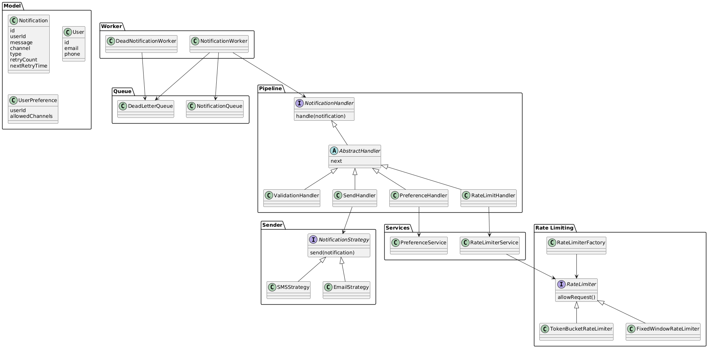

# Notification System 🚀

A scalable, asynchronous notification system designed to demonstrate backend architecture, design patterns, and real-world system design concepts.

---

## 📌 Key Features

- 📬 Multi-channel support (Email, SMS)
- ⚡ Asynchronous processing using queue + workers
- 🔁 Retry with exponential backoff
- ☠️ Dead Letter Queue (DLQ) for failed notifications
- ⚙️ Processing pipeline (validation → preference → rate limit → send)
- 🚦 Per-user rate limiting (Token Bucket / Fixed Window)

---

## 🏗️ Architecture Overview
Event → Notification → Queue → Worker → Processing Pipeline → Send
↓
Retry / Dead Letter Queue (DLQ)
---

## 🧩 System Diagrams

### Class Diagram

---

## ⚙️ Core Design Highlights

- **Asynchronous Processing**
    - Decouples request handling from execution
    - Improves scalability and responsiveness

- **Pipeline Architecture**
    - Modular processing using Chain of Responsibility
    - Easy to extend (add/remove steps)

- **Failure Handling**
    - Retry with exponential backoff
    - DLQ ensures no data loss

- **Rate Limiting**
    - Per-user isolation
    - Prevents system overload

---

## 🧠 Design Patterns Used

- Strategy Pattern → channel handling & rate limiting
- Factory Pattern → dynamic strategy creation
- Chain of Responsibility → processing pipeline

---

## ▶️ How to Run

1. Clone the repository
2. Open in IntelliJ / any Java IDE
3. Run `Main.java`

---

## 📚 Detailed Design

For deeper explanation of design decisions, tradeoffs, and evolution:

👉 See [DESIGN.md](./DESIGN.md)

---

## 🎯 Why This Project?

This project focuses on **real backend problems**, not just code:

- Handling failures reliably
- Designing for scalability
- Managing concurrency safely
- Applying design patterns meaningfully

---

## 👨‍💻 Author

Aditya Kumar